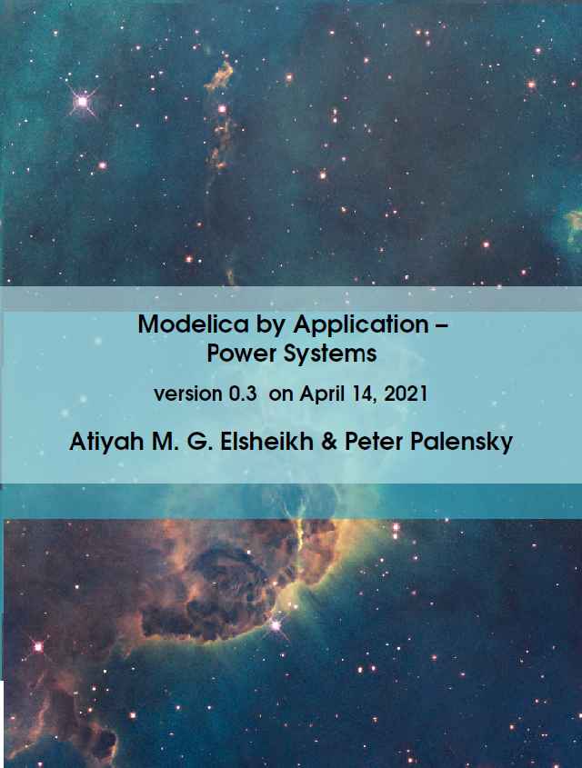

# Modelica by Application -- Power System 

## Sponsorship 

Drop an email to PowerSystemBook-at-mathemodica.com if you'd like to advertise your products or place the logo of your company at an early page of the book. However, the authors have the right to refuse or reject a non relevant request without stating the reasons. 

## Release Notes 

- 2021-04-14 V0.3   : First public announcement 
- 2021-04-21 V0.3.1 : Outline of the book added in Ch. 1 + minor formatting improvements  
- 2021-06-21 V0.4   : Improved formulation, Improved formatting (1st 6 chapters), improved bibliography style, linkes to Modelica by Examples, new cover and new pictures  
- 2021-07-10 V0.5   : Improved formulation and formatting of later chapters of the book. A section on commercial libraries. 
- 2021-07-19 V0.5.1 : More relevant references and section 7.9 Educational materials is separated into two sections Books & Education efforts  
- 2021-07-21 V0.5.2 : Improved Bibliography style and minor formatting issue

## Cover

## About 

#### Summary 

This is a comprehensive but a concise and educational e-book aiming at advertising Modelica-based technologies particularly useful for power system modeling applications. We hope that this printable booklet to be useful not only for power system modelers desiring to get a quick but compact idea about the benefits of employing Modelica but also for those Modelicans desiring a starting guide into the world of Power System Modeling applications.  

#### 1st Edition

To appear Sep. the first of 2021

#### License 

This book is provided under the terms of [CC BY-NC-SA 4.0 license](https://creativecommons.org/licenses/by-nc-sa/4.0/)

#### Outline (Current Release V0.5)

view [actual outline](https://github.com/Mathemodica/ModelicaPowerSystemBook/blob/main/ModelicaPowerSys-outline.pdf)

#### Sample Chapters 

- [Chapter 1: Introduction](https://github.com/Mathemodica/ModelicaPowerSystemBook/blob/main/samples/MPS_ActualVersion_Towards1.0-Ch1.pdf)
- [Chapter 7: Current State of Modelica](https://github.com/Mathemodica/ModelicaPowerSystemBook/blob/main/samples/MPS_ActualVersion_Towards1.0-Ch7.pdf)
- [Chapter 8: Relevant Modelica Libraries](https://github.com/Mathemodica/ModelicaPowerSystemBook/blob/main/samples/MPS_ActualVersion_Towards1.0-Ch8.pdf)

## Subscription 

Get actualized news on future updates by subscribing to the newsletter https://gumroad.com/mathemodica

## Costs 

First Edition can be pre-ordered for 

* Free or 
* As-much-As-You-Think-This-Book-Deserves 

#### Purchase

Pre-order 
- Edition 1.0 [here](https://gum.co/mathemodica-powsys)
- Edition 1.0 for free [here](https://gum.co/mathemodica-powsys-free) 

To be delivered 5th of Sep. by Email.
